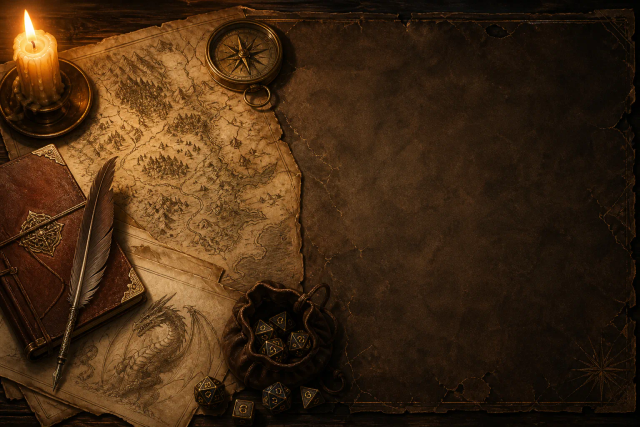
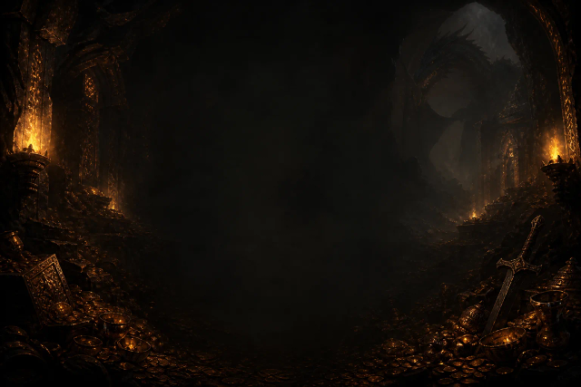

# 龙与地下城 · DSH 皮肤 (Dungeons & Dragons skin for DeepSeek Harness)

一个 D&D 奇幻风格的 [DeepSeek Harness](https://github.com/deepseek-ai/deepseek-harness) 桌面端皮肤。

- 亮色主题：冒险者羊皮纸卷宗（暖纸色 / 深棕墨 / 深铜金）
- 暗色主题：龙巢地牢（炭黑棕 / 余烬橙 / 秘银蓝）
- **gpt-image-2 生成**的 D20 骰子发送按钮：等待发送时显示「20」面；AI 工作时播放骰子翻滚帧动画
- 输入框与主要按钮为深金方框，其余界面元素改为直角
- 全套 dsh token 重映射（面板 / 滚动条 / 链接 / 选区 / 按钮 / 代码图）

## 预览

| 亮色 | 暗色 |
|---|---|
|  |  |

## 安装

### 方式一：命令行安装

```sh
dsh plugin --profile web-desktop add github:3b2ht90/dsh-client-ui-skin-dnd
```

### 方式二：手动安装（桌面端内置皮肤方式）

1. 克隆本仓库，把整个 `dsh-client-ui-skin-dnd` 目录放到桌面端皮肤目录：
   - Windows: `C:\Program Files\Deepseek Harness EAC\resources\app\assets\skins\`
2. 重启桌面端（重启 Web 服务即可：⋯ 菜单 → 重启 Web 服务）
3. 打开 **设置 → 皮肤** → 找到「龙与地下城」→ 点击应用

> 皮肤切换后若未生效，请重启 Web 服务（会中断当前会话，历史记录保留）。

## 使用说明

- 输入框有内容时，发送按钮是带「20」面的骰子
- 点击发送后 AI 工作时，按钮变为翻滚的骰子动画（点击可停止）
- 亮/暗主题的骰子配色不同（朱红 / 金色）

## 从源码重建

本皮肤由构建脚本从配色表 + 素材生成：

- `lib/client.js` 内嵌全部 CSS 与图片（base64 data URL），无需外部静态资源
- 背景画与骰子图为 gpt-image-2 生成（经 OpenAI 兼容接口），后处理（裁剪 / 去底 / 锐化 / 精灵帧归一化）使用 sharp 完成

如需重新生成美术素材，需要自行配置可用的 gpt-image 端点与密钥（`api.env`：`BASE_URL` / `API_KEY` / `MODEL` / `SIZE`），并参考构建脚本流程。**请勿将密钥提交到仓库。**

## 署名与许可

- 皮肤 chrome 结构以 `@linxin666/dsh-client-ui-skin-dragon-heir`（dsh-web-ui，BSD-3-Clause）的样式骨架为模板重映射生成，详见 `NOTICE.md`
- 背景画与骰子图由 gpt-image-2 生成（AI 生成图像不享有人类作者署名）
- 本皮肤采用 BSD-3-Clause 许可，见 `LICENSE`

## 许可

BSD-3-Clause，见 [LICENSE](LICENSE)。
